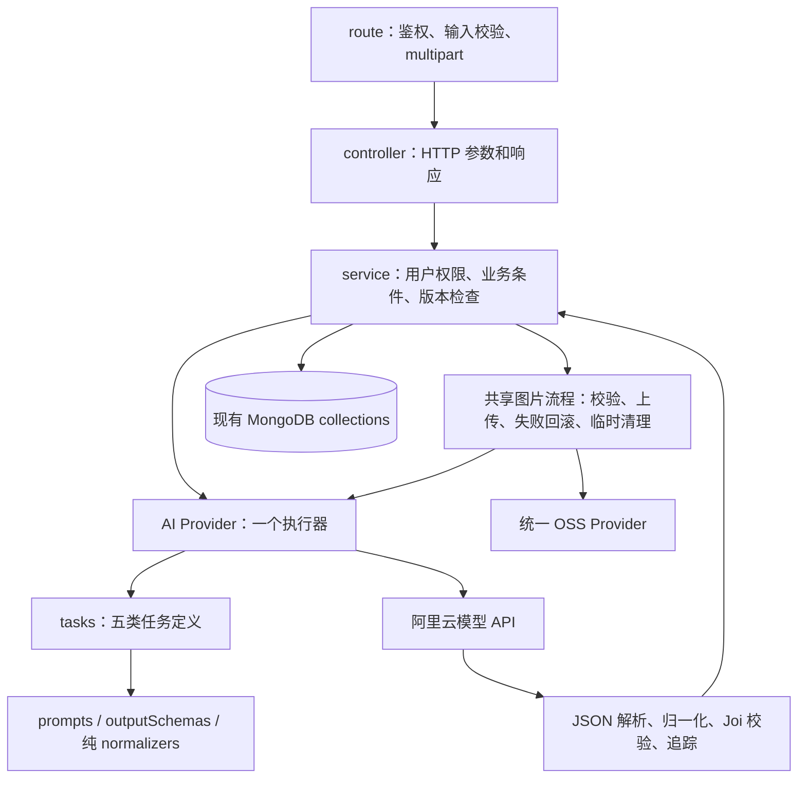

# 后端复用、冗余清理与验收 · 2026-09-10

## 设计结论

保留现有 Express 5 + Mongoose 模块化单体。当前问题主要是同一职责分散、旧实现入口残留和失败清理不一致；现有框架足以承载这些分析 API。本轮整理已经存在的共享执行链，未新增运行时依赖，也没有更换数据库或 HTTP 接口。

本轮直接阅读 Express boilerplate、Vercel AI、OpenAI Node 的固定版本源码。前者用于对照 route/controller/service 的职责，后两者用于对照模型任务、结构化输出和传输配置的边界。[源码版本、18 个引用链接及具体取舍](/Users/mac/Documents/ChatGPT/ios/AI_skin/backend/doc/architecture-references-20260910.md)。这些项目的依赖版本、默认重试和弃用 API 没有照搬到 AIskin。

## 现在的结构

箭头展示职责与依赖；不同业务保留自己的执行顺序。成分分析继续由上传图片、OCR、成分分析三个既有 API 串联；肌肤分析的同一个 API 完成上传、模型分析和保存。两者共享适合复用的底层步骤，服务端没有新增后台任务状态机。

| 职责 | 唯一实现 / 使用方式 |
| --- | --- |
| 创建应用、依赖、监听与退出 | `server.js → src/index.js → createApp/createDomainServices` |
| 五类 AI 任务的模型键、版本、schema、消息和返回转换 | `src/providers/ai/tasks.js`；OCR、成分、冲突、方案、肌肤由同一目录生成五个公开方法 |
| 统一 HTTP、超时、解析校验、错误和追踪 | `src/providers/ai/dashscopeProvider.js` 的 `call` |
| 领域输出兼容转换 | `src/providers/ai/outputNormalizers.js`，函数体从原实现原样迁出 |
| 产品 / 人脸的图片资源生命周期 | `src/services/imageUpload.workflow.js`，在 services 工厂创建一个实例供两模块使用 |
| 产品并发版本、旧图清理、记录保存 | 仍由 `product.service.js` 明确控制；旧图只在新记录提交后清理 |
| 数据库字段与索引 | 现有 `models/`，本轮没有迁移或重写已有数据 |

新增 AI 任务时，仍需要定义业务提示词、输出 schema 和必要的 service 行为；模型任务注册后复用同一网络与校验执行器，不再复制整套 HTTP 代码。模型归一化变更也不需要修改供应商传输文件。

## 修复了什么

1. 五类任务的配置和返回转换从供应商网络文件中分离；原 `dashscopeProvider.js` 从 346 行降到 107 行。拆分本身的生产代码净增加 21 行，因此不把移动代码称作删除。
2. 产品和人脸共用图片验证、上传、失败回滚与临时清理。保留产品 JPEG/PNG/GIF、人脸 JPEG/PNG 的既有边界，保留各自缺图错误码及产品用户归属检查顺序。
3. 修复清理异常覆盖业务结果：AI/DB 已失败时保留原错误；已经提交成功时，临时文件清理失败只写脱敏错误事件，不把成功响应改成 500。旧图清理仍有原有 pendingStorageKeys 重试记录。
4. 补齐冲突与方案的 controller → service → provider requestId，五类模型日志可关联业务 HTTP。肤况/OCR/成分的已有原文与配置持久化保持兼容；冲突和方案仍沿用原本的业务存储结构，本轮没有声称为它们补存历史原文。
5. OSS 的临时文件清理函数由配置正常和未配置两条路径共同复用。
6. 真实 E2E 使用同一份 `loadConfig` 模型配置，去掉测试中硬编码覆盖三类模型的分支，避免测到与当前服务不同的 OCR 模型。新增 OSS 图片字节与删除后 404 核验。

失败对象回滚如果也失败，目前会记录 `image_cleanup_failed` 脱敏事件，不能声称对象已删除。临时文件删除失败也有事件可定位。本轮没有增加通用持久化清理队列；这种外部存储异常仍需要运维处理。

## 删除和保留

删除 19 个经引用检查确认无运行时作用的文件，共 2,480 行：8 个根目录 models/config 兼容转发、10 个旧手工测试脚本、1 个重复配置测试。旧脚本使用过时邮箱认证、固定端口或自动启动开发服务，正式 Jest 的 auth/business/prototype/runtime/真实 E2E 已覆盖其有效业务范围。配置 override 测试迁入 unit/config.test.js。

保留 14 个生产依赖、所有已挂载 HTTP 能力，以及真实 E2E 使用的两张图片。`src` 中原有运行模块都能从入口到达，没有仅凭“iOS 暂未调用”删除能力。历史文档与原型资源保留，当前运行说明统一指向正式测试入口。

[当前 Swift 的 44 项接口契约及源码位置](/Users/mac/Documents/ChatGPT/ios/AI_skin/backend/doc/api-contract-20260910.md) 已逐项核对；另外保留 Apple 绑定、月经信息、冲突兼容路径、反馈 CRUD、health/ready。父 AGENTS 文档只更新了过时的 Apple 和接口数量事实，开发约束不变。

最终 JavaScript 总行数从 7,961 降到 5,807，净减少 2,154 行，包含新增共享模块、回归测试和诊断代码；主要来自旧手工脚本清理。src 运行时代码为 3,083 → 3,118 行，职责拆分并不等于大幅减少生产代码。

本轮统计以开始时的私有快照为基准，不用整个未提交工作区相对 Git HEAD 的差异冒领之前改动。备份、逐文件 SHA-256、行数统计和最终日志位于 `/Users/mac/Library/Application Support/AISkin/audits/20260910-backend-architecture`，未复制 .env、会话文件或用户图片。

## 验证记录

- 改造前基线：16 套件、92 项通过，真实收费 E2E 默认跳过。
- Provider：33/33 通过；五类任务与修改前快照的实际请求内容、消息顺序、超时和公开返回结构一致，仅排除随机 ID 和时间。
- 图片故障：先复现 4 项失败，再通过共享流程修复；覆盖 AI/DB 与清理同时失败、提交后临时清理失败、旧图保留、上传/OCR/成分分析竞态、缺文件和格式边界。
- 追踪：冲突和方案两项跨 HTTP → service → provider 断言先失败，再修复通过。
- 首次全量复测：111 项通过、1 项旧 daily records 用例发生 60 秒超时。失败记录保留，独立重跑该套件 9/9 通过；已补充有限的请求阶段诊断；尚不能确定根因，不将一次重跑成功当作问题已根治。
- 最终全量：`npm run check` 和 `npm test` 通过，15 套件 / 112 项通过，1 项收费 E2E 默认跳过；耗时 16.287 秒。
- 真实外部 E2E：单独显式开启，1 项完整流程通过；6 次真实模型调用（OCR 2、成分/冲突/方案/肌肤各 1），45 个 HTTP/图片检查点通过，耗时 158.491 秒。三个上传图片 SHA-256 与源文件一致，三个删除后 OSS 地址均返回 404；测试账号、业务记录和三个临时对象完成清理。
- 实际模型：OCR/肌肤 `qwen3-vl-plus`，成分/冲突/方案 `qwen3.7-flash`；6 次调用都有业务 requestId 和供应商响应标识。
- 本地持久服务：确认原 5001 端口进程身份后优雅停止，以原 Node 22.22.1 运行时启动当前源码，PID 24647，仍连接既有本地 MongoDB。测试命令使用 shell 的 Node 26.0.0，二者版本在证据中明确区分。
- 既有报告回读：8 个真实 HTTP GET、3 次原图字节核验、1 次全量业务响应对照，共 12 个检查点通过。重启前后的两份成分报告、一份肌肤报告和用户信息一致；不新增 AI 调用、不覆盖历史报告。
- 测试超时边界：既有 daily 用例单独重复未复现，最终全量也通过；尚不能确定首次超时原因。仅增加请求限时与等待阶段诊断，没有扩大 Jest 限时、自动重试或改日记录业务。

普通 unit/contract/integration 中的 AI、OSS、Apple 和短信是替身。真实 E2E 使用独立 MongoDB 与随机 loopback 端口，只有实际模型/OSS 调用通过才能算真实外部证据；本地持久库回读另行检查。

## 保持明确的边界

本轮没有启用自动模型重试，没有修改提示词正文或更换模型。先前发现的 OCR 错字和肌肤因果用语仍属于内容质量问题，不能凭架构测试通过宣称已解决。接口同步执行，尚无重启恢复任务或通用幂等任务队列。

本轮只修改本地后端，不部署生产，不改 iOS UI，不将代码检查或 HTTP 成功冒充实体 iPhone / Apple 实际登录验收。现有用户未提交改动保留；提交、推送、合并与部署状态另行处理。

## 可复核的本轮证据

- [逐文件改动与行数统计](</Users/mac/Library/Application Support/AISkin/audits/20260910-backend-architecture/change-summary.json>)
- [最终全量回归日志](</Users/mac/Library/Application Support/AISkin/audits/20260910-backend-architecture/aiskin-architecture-final-tests-rerun-20260910.log>)
- [6 次真实模型调用与 45 项检查](</Users/mac/Library/Application Support/AISkin/audits/20260910-backend-architecture/real-e2e-evidence.json>)
- [持久库报告重启回读](</Users/mac/Library/Application Support/AISkin/audits/20260910-backend-architecture/persistent-readback.json>)
- [当前本地进程记录](</Users/mac/Library/Application Support/AISkin/audits/20260910-backend-architecture/local-runtime.json>)

这些是本轮后端证据。本轮没有重复运行 iOS UI 测试，也没有把上一轮前端 31 项单测 / 6 项 Mock UI 用例算作后端真实链路证明。
